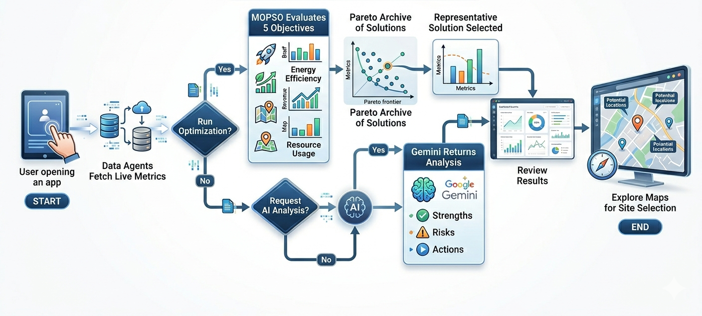
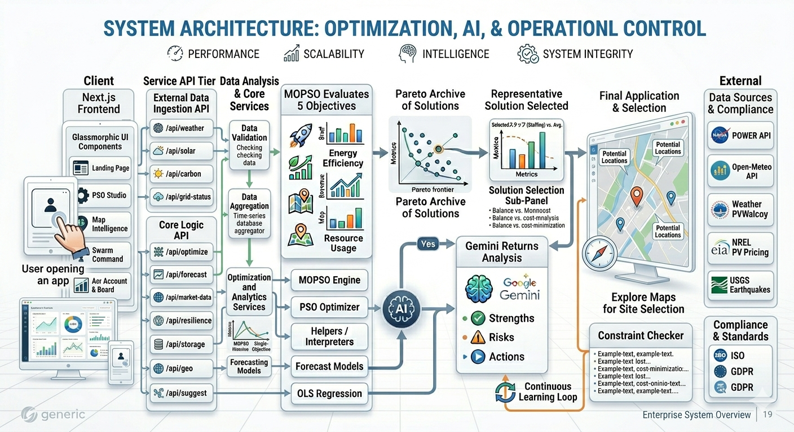
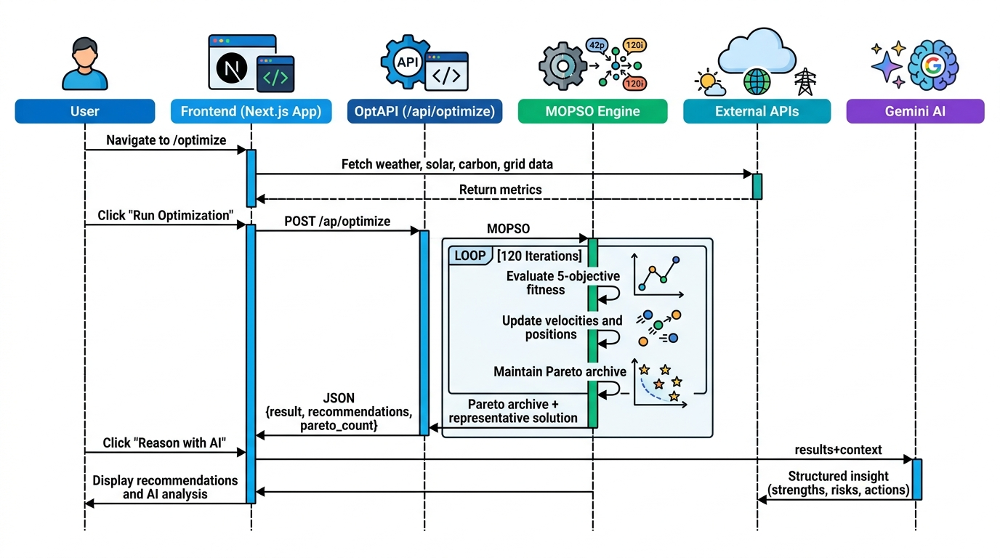
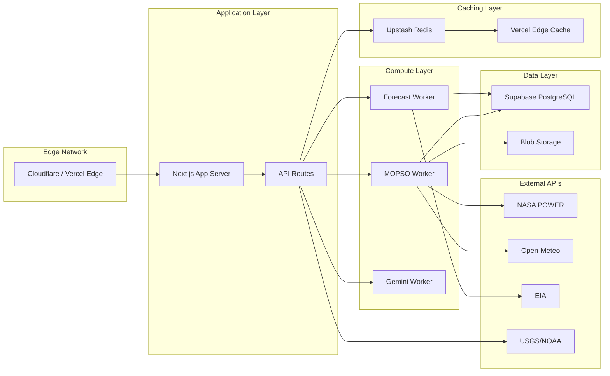

# SwarmGrid AI

Multi-objective swarm intelligence platform for renewable energy grid optimization. SwarmGrid AI applies Particle Swarm Optimization (PSO) across five objectives -- cost, sustainability, energy output, disaster resilience, and maintenance feasibility -- to produce deployable energy grid configurations backed by real-time meteorological and geospatial data.

## Table of Contents

- [Workflow](#workflow)
- [Architecture](#architecture)
- [Folder Structure](#folder-structure)
- [Key Features](#key-features)
- [Optimization Engine](#optimization-engine)
- [API Documentation](#api-documentation)
- [Getting Started](#getting-started)
- [Deployment](#deployment)
- [Real-World Application](#real-world-application)
- [Scalability and Roadmap](#scalability-and-roadmap)
- [Business Impact](#business-impact)
- [Tech Stack](#tech-stack)
- [License](#license)

## Workflow



### Step-by-step

1. **Data collection** -- Six agents poll free APIs (NASA POWER, Open-Meteo, EIA, USGS) for weather, solar, carbon, grid, pricing, and geospatial data.
2. **Optimization** -- The MOPSO engine runs 120 iterations across 42 particles, each encoding a different energy grid configuration.
3. **Pareto filtering** -- Non-dominated solutions are stored in an archive ranked by crowding distance, exposing the full trade-space.
4. **Solution selection** -- A scalarization function picks the single best trade-off from the archive.
5. **AI reasoning** (optional) -- Gemini analyzes the result and returns structured recommendations.
6. **Map exploration** -- Users inspect geographic coordinates on the Leaflet map to validate deployment feasibility.

## Architecture



## Folder Structure

```
EnergySwarm/
├── public/                              # Static assets
│   ├── nature-4k-pc-full-hd-wallpaper-preview.jpg
│   ├── mystical-forest-2880x1800-14976.jpg
│   ├── swarmbackgorund.jpg
│   └── nature-background-high-resolution...jpg
│
├── src/
│   ├── app/                             # Next.js App Router
│   │   ├── page.tsx                     # Landing page
│   │   ├── layout.tsx                   # Root layout
│   │   ├── globals.css                  # Global styles
│   │   │
│   │   ├── agents/                      # Swarm command center
│   │   │   └── page.tsx
│   │   │
│   │   ├── analytics-board/             # Research-grade analytics
│   │   │   └── page.tsx
│   │   │
│   │   ├── dashboard/                   # Metrics dashboard
│   │   │   └── page.tsx
│   │   │
│   │   ├── demo/                        # Interactive demo
│   │   │   └── page.tsx
│   │   │
│   │   ├── maps/                        # Geospatial visualization
│   │   │   └── page.tsx
│   │   │
│   │   ├── optimize/                    # PSO optimization studio
│   │   │   └── page.tsx
│   │   │
│   │   ├── scroll/                      # Scroll-driven demo
│   │   │   └── page.tsx
│   │   │
│   │   └── api/                         # API Routes (13 endpoints)
│   │       ├── optimize/route.ts        # MOPSO optimization endpoint
│   │       ├── suggest/route.ts         # Gemini AI analysis endpoint
│   │       ├── weather/route.ts         # Open-Meteo weather data
│   │       ├── solar/route.ts           # NASA POWER solar irradiance
│   │       ├── carbon/route.ts          # Carbon intensity forecast
│   │       ├── grid-status/route.ts     # Grid reliability and demand
│   │       ├── forecast/route.ts        # 7-day demand/solar/wind forecast
│   │       ├── market-data/route.ts     # Electricity pricing (EIA)
│   │       ├── resilience/route.ts      # Disaster hazard assessment
│   │       ├── storage/route.ts         # Energy storage optimization
│   │       ├── geo/route.ts             # Geospatial terrain data
│   │       └── prices/route.ts          # Real-time electricity prices
│   │
│   ├── components/                      # React components
│   │   ├── landing/
│   │   │   ├── landing-experience.tsx   # Full landing page experience
│   │   │   ├── nature-swarm-canvas.tsx  # Particle canvas with nature bg
│   │   │   ├── floating-header.tsx      # Sticky navigation header
│   │   │   ├── floating-footer.tsx      # Sticky footer controls
│   │   │   └── spline-backdrop.tsx      # Spline 3D backdrop
│   │   │
│   │   ├── optimization/
│   │   │   └── PSOGraphs.tsx            # Convergence and Pareto charts
│   │   │
│   │   ├── ui/
│   │   │   ├── aurora-button.tsx        # Animated button variant
│   │   │   ├── gooey-filter.tsx         # SVG gooey effect filter
│   │   │   ├── pixel-trail.tsx          # Interactive pixel trail
│   │   │   └── button.tsx               # Base button primitive
│   │   │
│   │   ├── EnhancedMapComponent.tsx     # Leaflet map with PSO swarm layer
│   │   ├── MapSwarmVisualization.tsx    # Swarm particles on map
│   │   ├── SwarmCommandCenter.tsx       # Agent polling dashboard
│   │   ├── SwarmVisualization.tsx       # SVG particle visualization
│   │   ├── ResearchGradeDashboard.tsx   # Multi-tab analytics dashboard
│   │   ├── DataDashboard.tsx            # Real-time data display
│   │   ├── ErrorBanner.tsx              # Error notification component
│   │   ├── ErrorInlineCard.tsx          # Inline error display
│   │   ├── SkeletonCard.tsx             # Loading skeleton
│   │   ├── SkeletonChart.tsx            # Chart loading placeholder
│   │   ├── LoadingScreen.tsx            # Full-screen loader
│   │   ├── nav-header.tsx               # Shared navigation bar
│   │   ├── reveal-text.tsx              # Animated text reveal
│   │   └── swarm-agents.tsx             # Agent status cards
│   │
│   ├── hooks/
│   │   └── use-screen-size.ts           # Responsive breakpoint hook
│   │
│   ├── lib/                             # Core algorithms
│   │   ├── pso/
│   │   │   ├── mopso.ts                 # Multi-objective PSO with Pareto archive
│   │   │   ├── optimizer.ts             # Classic PSO with stagnation escape
│   │   │   ├── enhanced-optimizer.ts    # Extended PSO features
│   │   │   └── helpers.ts               # Fitness interpretation and recommendations
│   │   │
│   │   ├── inference/
│   │   │   ├── forecast.ts              # Demand and renewable forecasting
│   │   │   ├── ols.ts                   # Ordinary least squares regression
│   │   │   └── swarm.ts                 # Swarm inference utilities
│   │   │
│   │   ├── cache.ts                     # Request caching layer
│   │   └── utils.ts                     # Shared utilities
│   │
│   └── types/
│       └── spline-viewer.d.ts           # Spline 3D type declarations
│
├── scripts/                             # Automation scripts
│   ├── fix-optimize-jsx.mjs
│   └── patch-dashboard-ui.mjs
│
├── next.config.ts                       # Next.js configuration
├── tailwind.config.ts                   # Tailwind CSS configuration
├── tsconfig.json                        # TypeScript configuration
├── vercel.json                          # Vercel deployment config
├── postcss.config.js                    # PostCSS configuration
├── .env.example                         # Environment variable template
└── README.md                            # This file
```

## Key Features

### Multi-Objective Optimization Engine

The platform implements two PSO variants that optimize across five competing objectives simultaneously:

| Objective | Description | Weight |
|---|---|---|
| Cost | Minimize infrastructure and operational expenses | 20% |
| Sustainability | Maximize renewable energy integration | 25% |
| Energy Output | Optimize total power generation capacity | 25% |
| Disaster Resilience | Build redundant, fault-tolerant grid topology | 15% |
| Maintenance Feasibility | Ensure operational and service accessibility | 15% |

The MOPSO engine maintains a Pareto archive of non-dominated solutions using crowding distance sorting, enabling decision-makers to inspect the full trade-space rather than a single scalarized result.

### Real-Time Data Integration

Five independent data agents poll free, open APIs on every page load:

- **Weather Agent** -- Open-Meteo: temperature, wind speed, precipitation
- **Solar Agent** -- NASA POWER: solar irradiance, capacity factor estimation
- **Carbon Agent** -- Open-Meteo: grid carbon intensity forecast (g CO2/kWh)
- **Grid Agent** -- Simulated demand, reliability, voltage metrics
- **Forecast Agent** -- 7-day projections for demand, solar, wind, pricing
- **Market Agent** -- EIA electricity pricing and ancillary services data

### Geospatial Visualization

An interactive Leaflet map renders energy resource sites with layered controls for solar potential zones, wind corridors, and grid infrastructure. The PSO swarm visualization overlays particle positions directly on geographic coordinates, converging toward the optimal deployment site.

### AI Decision Support

The `/api/suggest` endpoint sends optimization results and real-time grid context to Google Gemini, which returns a structured analysis containing verdict, confidence score, key strengths, risks to monitor, and prioritized actions with impact ratings.

## Optimization Engine

### Algorithm Flow



### Configuration

```
Particles:        42
Iterations:       120
Archive Limit:    80
Leader Pool Size: 5
Mutation Rate:    0.20
Mutation Scale:   3.5
Stagnation Thresh:10 iterations
```

### Particle Position Encoding

Each particle is a 5-dimensional vector encoding:

1. Solar capacity allocation (MW)
2. Wind capacity allocation (MW)
3. Cost budget allocation ($M)
4. Risk mitigation investment
5. Maintenance budget allocation

## API Documentation

### POST /api/optimize

Runs the MOPSO algorithm and returns a representative solution from the Pareto archive.

**Request:** No body required. Configuration is server-side.

**Response:**

```json
{
  "success": true,
  "result": {
    "solarCapacity": 412.3,
    "windCapacity": 287.5,
    "cost": 65.2,
    "sustainability": 82.1,
    "energyOutput": 76.4,
    "disasterResilience": 71.8,
    "maintenanceFeasibility": 68.9,
    "score": -0.523
  },
  "recommendations": [
    "Increase solar capacity in high-irradiance zones",
    "Reduce maintenance allocation to reallocate toward resilience"
  ],
  "iterations": 120,
  "pareto_count": 47
}
```

### POST /api/suggest

Requests AI analysis of optimization results via Gemini.

**Request:**

```json
{
  "result": { "solarCapacity": 412.3, "windCapacity": 287.5, "cost": 65.2, ... },
  "context": "Location: New York, NY. Temperature: 22C. Carbon: 185 g/kWh."
}
```

**Response:**

```json
{
  "success": true,
  "suggestion": "The swarm solution balances cost and resilience effectively...",
  "analysis": {
    "summary": "1-2 sentence summary",
    "verdict": "Strong configuration",
    "confidence": 78,
    "strengths": ["Multi-objective trade-off keeps the solution resilient..."],
    "risks": ["Capital cost remains relatively high..."],
    "actions": [
      { "title": "Rebalance renewable capacity", "detail": "...", "impact": 5 }
    ],
    "metrics": [
      { "label": "Cost", "value": "$65.2M", "note": "Capital profile" }
    ]
  }
}
```

### GET /api/weather?latitude=40.71&longitude=-74.00

Returns current weather and wind data from Open-Meteo.

### GET /api/solar?latitude=40.71&longitude=-74.00

Returns solar irradiance and capacity factor from NASA POWER.

### GET /api/carbon?latitude=40.71&longitude=-74.00

Returns current and forecasted carbon intensity (g CO2/kWh).

### GET /api/grid-status?region=ny&hours=24

Returns grid demand forecast, reliability score, and voltage metrics.

### GET /api/forecast?latitude=40.71&longitude=-74.00&hours=168

Returns 7-day forecasts for demand, solar generation, wind generation, and pricing with confidence intervals.

### GET /api/market-data?region=PJM&horizon_hours=24

Returns day-ahead and real-time electricity pricing, ancillary services costs, and congestion data.

### GET /api/resilience?latitude=40.71&longitude=-74.00

Returns hazard assessment for earthquake, hurricane, flood, wildfire, severe weather, and grid failure with ROI analysis for mitigation strategies.

### GET /api/storage?latitude=40.71&longitude=-74.00&horizon_hours=24

Returns energy storage capacity, optimal dispatch schedule, cycling strategies, and economic modeling.

### GET /api/geo?latitude=40.71&longitude=-74.00

Returns terrain analysis, land use classification, and infrastructure proximity data.

## Getting Started

### Prerequisites

- Node.js 18+
- npm or pnpm

### Installation

```bash
git clone https://github.com/kris07hna/EnergySwarm.git
cd EnergySwarm

npm install

cp .env.example .env.local
# Add NEXT_PUBLIC_GEMINI_API_KEY to .env.local

npm run dev
```

Visit http://localhost:3000.

### Environment Variables

Only one variable is required for full functionality:

```
NEXT_PUBLIC_GEMINI_API_KEY=
```

All other data sources (NASA POWER, Open-Meteo, OpenStreetMap) are free and require no API keys.

## Deployment

### Vercel (Recommended)

The project includes `vercel.json` with production settings:

```bash
npm run build
vercel
```

Or connect the repository directly in the Vercel dashboard. The build is configured to:

- Compress responses
- Strip the `X-Powered-By` header
- Optimize images to AVIF/WebP formats
- Set security headers (X-Frame-Options, X-Content-Type-Options, X-XSS-Protection)
- Deploy to the iad1 region

### Environment Configuration on Vercel

Set the following in the Vercel project settings:

| Variable | Value |
|---|---|
| `NEXT_PUBLIC_GEMINI_API_KEY` | Your Gemini API key from https://ai.google.dev |

## Real-World Application

### Utility-Scale Energy Planning

Power companies evaluating multi-billion-dollar renewable investments require tools that model trade-offs across cost, grid reliability, and environmental impact. SwarmGrid AI provides:

- **Site selection**: The MOPSO engine identifies optimal geographic coordinates for solar and wind deployment based on real irradiance, wind speed, and grid proximity data.
- **Portfolio optimization**: Decision-makers can inspect the full Pareto frontier to choose between cheaper but riskier configurations versus more resilient but capital-intensive alternatives.
- **Disaster preparedness**: The resilience module models exposure to hurricanes, earthquakes, floods, and wildfires, then quantifies the return on investment for hardening measures.

### Municipal Energy Policy

City planners without access to enterprise grid modeling software ($100,000+ for Plexos or Aurora) can use SwarmGrid AI to:

- Model renewable energy targets against current grid capacity
- Evaluate storage requirements for peak-shaving and emergency backup
- Produce data-backed recommendations for public consultation

### Academic Research

The platform provides a complete implementation of MOPSO with Pareto archiving and crowding distance, making it suitable for:

- Teaching evolutionary computation and multi-objective optimization
- Extending the algorithm with new objectives or constraint handling
- Publishing comparative studies against genetic algorithms or simulated annealing

### Investment Analysis

Renewable energy developers can prototype site evaluations by inputting coordinates to receive:

- Estimated capacity factors for solar and wind at that location
- Projected carbon intensity of the local grid
- Preliminary cost estimates for grid connection

## Scalability and Roadmap

### Current Limitations

| Area | Current State | Planned Improvement |
|---|---|---|
| Data freshness | API calls on page load | Server-side caching with configurable TTL |
| Geographic scope | US-focused coordinates | Global coverage with region-specific API sources |
| Optimization scale | 42 particles, 120 iterations | Configurable swarm size with GPU-accelerated evaluation |
| Persistence | No database | Supabase/PostgreSQL for project history and collaboration |
| Authentication | None | NextAuth.js with role-based access (Operator, Analyst, Planner) |
| Export | Manual screenshot | PDF report generation and GeoJSON/CSV export |

### Proposed Architecture for Production Scale



### Phase 2 Features

1. **Genetic Algorithm alternative** -- NSGA-II implementation for comparative optimization
2. **Multi-region optimization** -- Simultaneous deployment planning across 2-5 regions with transmission constraints
3. **Historical analysis** -- Time-series database of optimization runs with trend visualization
4. **Team collaboration** -- Shared workspaces, comments on optimization results, approval workflows
5. **Real-time WebSocket updates** -- Live streaming of particle positions during optimization
6. **Custom constraint editor** -- User-defined constraints (budget caps, land availability, regulatory limits)

## Business Impact

### Market Opportunity

The global energy management systems market is projected to reach $47.8 billion by 2028 (Grand View Research). SwarmGrid AI addresses a gap in this market:

- **Existing tools** (Plexos, Aurora, PLEXOS) cost $100,000+ in licensing, require specialized training, and run on-premise.
- **SwarmGrid AI** is open-source, browser-based, requires no installation, and provides comparable multi-objective optimization at zero licensing cost.

### Target Users

| Segment | Use Case | Willingness to Pay |
|---|---|---|
| Utility companies | Portfolio optimization, site selection | High (enterprise SaaS) |
| Municipal governments | Policy modeling, public consultation | Medium (annual license) |
| Energy consultants | Client deliverables, rapid prototyping | Medium (per-project) |
| Academic researchers | Teaching, algorithm comparison | Low (free/open-source) |
| Hackathon teams | Proof-of-concept demonstrations | None (community) |

### Competitive Advantages

1. **Zero-cost data pipeline** -- All external APIs are free with generous rate limits, eliminating data acquisition costs.
2. **Browser-native execution** -- No server infrastructure required for the optimization engine; runs in the Next.js server function.
3. **Multi-objective transparency** -- Unlike black-box optimizers, the Pareto archive exposes the full trade-space for human decision-making.
4. **AI-augmented reasoning** -- Gemini provides structured analysis tied directly to optimization outputs, not generic recommendations.
5. **Open-source extensibility** -- The algorithm implementation is fully auditable and modifiable, critical for regulatory compliance.

## Tech Stack

| Layer | Technology | Purpose |
|---|---|---|
| Framework | Next.js 16 | App Router, API routes, server components |
| Language | TypeScript 5.7 | Type-safe application code |
| Styling | Tailwind CSS 3.4 | Utility-first responsive design |
| Components | Base UI, shadcn/ui | Accessible UI primitives |
| Animation | Framer Motion 11 | Page transitions, scroll effects |
| Charts | Recharts 2.15 | Time-series, bar, pie, scatter visualizations |
| Mapping | Leaflet 1.9 + React Leaflet | Geospatial visualization with custom markers |
| 3D | Spline (@splinetool/react-spline) | Interactive 3D backdrops |
| AI | Google Gemini Flash | Structured decision analysis |
| Data | NASA POWER, Open-Meteo, EIA, USGS | Free meteorological and energy APIs |
| Deployment | Vercel | Serverless hosting, edge network |

## License

MIT License. See the license file for details.
